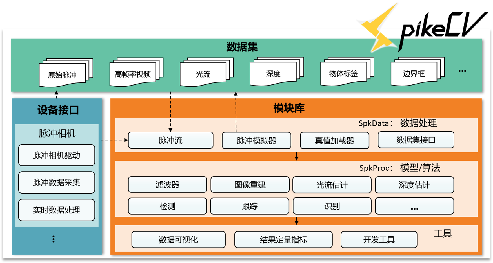

**注意**：目前是开发版本，部分用例尚未通过测试。


面向超高速脉冲相机的开源视觉框架 —— **SpikeCV**

> ”我们不仅提供锤子，还制造钉子，捕光制电，让我们打开前所未见的视觉新世界。 “

[](https://spikecv.readthedocs.io/zh/latest/?badge=latest)

中文|[English](./README_en.md)

SpikeCV具体文档地址为：https://spikecv.readthedocs.io


---

## 简介

### 脉冲相机

超高速脉冲相机模拟灵长类视网膜编码原理，每个像素位置直接根据光强变化独立发放脉冲。如下图(b)中显示，当光子累计达到预先设定好的阈值时就产生脉冲比特流，1表示发放脉冲，0表示无脉冲。与图(a)中展示的传统相机成像区别是，常见的数码相机按照一个较低的固定频率产生静止图片序列，无法有效记录光的高速变化过程，例如拍摄场景存在高速运动时，产生的图片会存在运动模糊。而脉冲相机目前可按照40KHZ的频率将光信号转化为脉冲比特流，记录的视觉时空变化较为完整，可应用超高速视觉场景的采集、表示、编码、检测、跟踪和识别等任务。 


> 上图出自论文：Huang T, Zheng Y, Yu Z, et al. 1000× Faster Camera and Machine Vision with Ordinary Devices[J]. Engineering, 2022. 更多关于脉冲相机的细节请参考这篇文章。 

### SpikeCV 架构



如上图所示，SpikeCV主要包含三个部分：

1. **脉冲相机数据集**：
   - Raw Spikes：由脉冲相机产生或模拟器生成的脉冲流
   - HFR Videos：与脉冲流对应的高帧率视频流（High-Frame-Rate Videos, HFR)，可用于检验基于脉冲相机的超高速场景重构算法
   - Optical Flow：拍摄/模拟场景的光流信息
   - Stero Depth：双目、单目脉冲相机拍摄场景的深度信息
   - Object Labels：场景中物体的类别标签信息
   - Bounding Boxes：表示运动/前景物体所在位置及大小的候选框，可用于检测、跟踪等任务
2. **设备接口**：提供脉冲相机驱动及配套的数据采集，实时脉冲数据处理接口。可支持用于目前已发行的脉冲相机作为输入，或使用离线文件进行模拟相机数据调试
3. **模块库**：
   - SpkData：包含脉冲数据类SpikeStream，脉冲相机模拟器，与用于加载脉冲相机数据与脉冲流对应的标签数据（Ground Truth, GT），和模拟脉冲相机原理的脉冲生成
   - SpkProc：面向脉冲相机的模型及算法，包含*Filters滤波器*、*Reconstrution重构算法*、*OF Estimation光流估计*、*Depth Estimation深度估计*、*Deteciton 物体检测*、*Tracking多目标跟踪* 和*物体识别* 等模块
   - Tools：工具类接口，包含：
     - `Visualization` —— 脉冲流或各类视觉任务结果的可视化
     - `Metrics` —— 各类视觉任务结果的定量评价指标
     - `Utils` —— 辅助开发工具，例如数据路径处理等

## 安装说明 

### 安装

建议使用[Anaconda](https://www.anaconda.com/)创建专属于 `SpikeCV` 的使用环境

```bash
# 从启智平台下载代码仓库
git clone https://git.openi.org.cn/Cordium/SpikeCV.git 
cd SpikeCV
python setup.py install
```

### 数据集

`SpikeCV` 脚本的运行依赖于开源框架的数据集，因此请确保所执行任务对应的数据集下载成功，可通过网页下载或是通过命令行从指定的数据集链接下载，例如：

```bash
cd SpikeCV\SpkData\datasets
wget -c SpikeCV数据集的网页链接 -O | tar -xz
```

对于较大的数据集，建议直接从启智SpikeCV仓库的[数据集地址](https://git.openi.org.cn/Cordium/SpikeCV/datasets)下载，并将数据集文件夹解压缩到`SpikeCV\SpkData\datasets` 目录下。 

#### 目前已开源的数据集包括：


<table width="100%">
    <col width="10%">
    <col width="20%">
    <col width="70%">
    <thead>
        <tr>
            <th align="center"><b>数据集名称</b></th>
            <th align="center"><b>描述</b></th>
            <th align="center"><b>样例</b></th>
        </tr>
    </thead>
    <tbody>
        <tr>
            <td align="center"><b>recVidarReal2019</b></td>
            <td align="center">脉冲相机高速运动数据集。包括超高速运动物体（ClassA）和相机高速运动（ClassB）两类场景。</td>
            <td align="center"></td>
        </tr>
        <tr>
            <td align="center"><b>motVidarReal2020</b></td>
            <td align="center">脉冲相机真实拍摄的多目标检测跟踪数据集，带有标签数据，可用于多目标运动物体的检测跟踪任务。</td>
            <td align="center"></td>
        </tr>
        <tr>
            <td align="center"><b>momVidarReal2021</b></td>
            <td align="center">Multi-Object-Motion 脉冲数据集：51段真实场景脉冲序列；提供多种物体运动模式和高速运行场景下的实拍Vidar脉冲流，种类丰富，速度较快；可用于脉冲图像重构、高速目标检测跟踪、运动分析(运动分割、光流估计)等任务。</td>
            <td align="center"></td>
        </tr>
        <tr>
            <td align="center"><b>OpticalFlowSPIFT</b></td>
            <td align="center">模拟多种飞行物体Spike flything things （SPIFT）场景，带有高速移动目标的光流数据，可应用于高速场景重构、高速目标检测跟踪、运动分析等任务（如光流估计等）。</td>
            <td align="center"></td>
        </tr>
        <tr>
            <td align="center"><b>OpticalFlowPHM</b></td>
            <td align="center">模拟真实场景高速运动Photo-realistic High-speed Motion（PHM）场景，带有高速移动目标的光流数据，可应用于高速场景重构、高速目标检测跟踪、运动分析等任务（如光流估计等）。</td>
            <td align="center"></td>
        </tr>
        <tr>
            <td align="center"><b>PKU-Vidar-DVS</b></td>
            <td align="center">联合事件相机DVS和脉冲相机脉冲流的数据集，脉冲相机提供高速纹理采样，事件相机进行高速动态采样，提供12Meps的事件流, 25 Hz RGB图像（346 x 260）。该数据集提供候选框标注数据，可用于高速与极端光照场景下目标精准检测的任务。</td>
            <td align="center"></td>
        </tr>
        <tr>
            <td align="center"><b>PKU-Spike-Stereo</b></td>
            <td align="center">双目脉冲相机结合深度数据，提供脉冲流和ZED深度图，包含室内室外的高速运动场景，10类目标，887个深度标注图。</td>
            <td align="center"></td>
        </tr>
    </tbody>
</table>

## 引用方式

```bib
@misc{SpikeCV,
	title = {SpikeCV},
	author = {Zheng, Yajing and Zhang, Jiyuan and Zhao Rui and Ding, Jianhao and Li, Jianing and Chen, Shiyan and Yu, Zhaofei, Huang, Tiejun and other contributors},
	year = {2022},
	howpublished = {\url{https://git.openi.org.cn/Cordium/SpikeCV.git}},
}
```

更多脉冲相机的相关文章请参见 [Publications.md](https://git.openi.org.cn/Cordium/SpikeCV/src/branch/master/Publications.md)。

若有问题可通过以下邮箱进行咨询：

* spikecv@outlook.com

## 开源许可证

SpikeCV 开源项目是在`Apache2.0许可证`下授权的，请参考[License.md](https://git.openi.org.cn/Cordium/SpikeCV/src/branch/master/License.md)查阅许可详情。

## 开发单位


**SpikeCV**是由北京大学**视频与视觉技术国家工程研究中心**牵头组织，脉冲视觉公司参与的开源项目。

