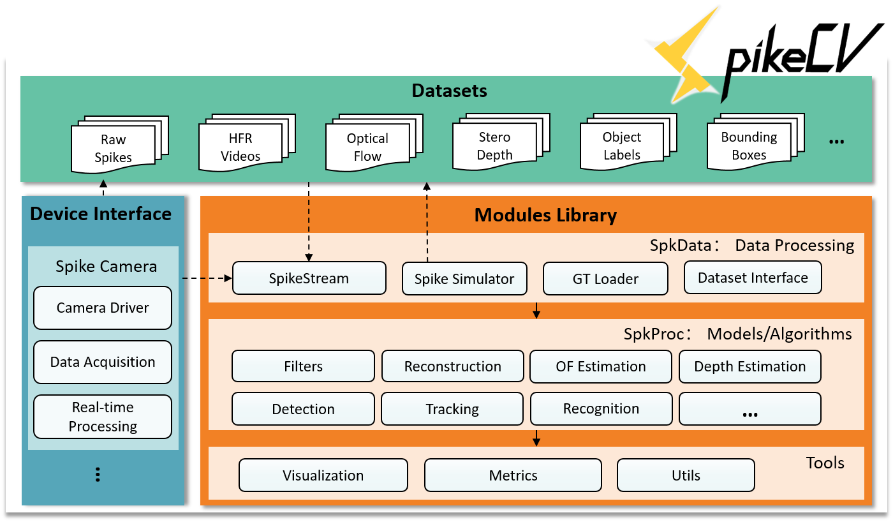

**注意**：目前是开发版本，部分用例尚未通过测试。


 **SpikeCV** is an open-source project for `spike camera`, mainly including spiking datasets, algorithms library and hardware interface.

> We not only make the hammers (tools), but also the spikes (data). Capturing light and make electricity opens us a new world of vision we have never seen before.

[](https://spikecv.readthedocs.io/zh/latest/?badge=latest)

[中文](./README.md)|English

To learn more about the SpikeCV, please refer to the documentation at https://spikecv.readthedocs.io.


---

## Introduction

### Spike camera

Mimicking the sampling mechanism of the fovea of primate retina, a retina-inspired camera, named **spike camera**, outputs asynchronous binary spike streams by continuously capturing photons. As shown in Figure (b) below, when the photon accumulation reaches a preset threshold, a spike stream is generated. Generally, 1 means a spike is fired, and 0 means no spike. The difference from the traditional camera imaging is shown in Figure (a). The traditional digital camera records scenes with a constant shutter speed (e.g., 33 ms), which loses much visual information and suffers motion blur. The spike camera can record the external information with a sampling rate of 40 Khz, and retains high-speed spatio-temporal information for both moving and static objects, which can be applied to tasks as acquisition, detection, tracking and recognition of ultra-high-speed scenes.


> This figure is from article -- "Huang T, Zheng Y, Yu Z, et al. 1000× Faster Camera and Machine Vision with Ordinary Devices[J]. Engineering, 2022. " Please refer to this paper to learn more details about spike cameras.

### Architecture of SpikeCV



As shown in the figure above, SpikeCV mainly consists of three parts：

1. **Datasets**：
   - `Raw Spikes`: Off-line files of spike streams that generated by spike cameras or simulators.
   - `HFR Videos`: High-Frame-Rate  (HFR) Videos at the same sampling frequency as the spike camera,  which can be used to test the ultra-high-speed scene reconstruction algorithm based on the spike camera
   - `Optical Flow`: Ground truth optical flow information of the simulated scenes
   - `Stero Depth`: Depth information of scenes captured by binocular and monocular spike cameras
   - `Object Labels`: Class labels of objects in the scene
   - `Bounding Boxes`: Candidate boxes represent the location and size of moving/foreground objects, which can be used for tasks such as detection and tracking
2. **Algorithm Library**：
   - `SpkData`: Mainly used to load data generated by the spike camera, Ground Truth (GT) information corresponding to spike stream, and simulate spikes generation
   - `SpkProc`: Models and algorithms for spike cameras, including *Filters*, *Reconstruction algorithm*, *Optical Flow (OF) Estimation*, *Depth Estimation*, *Object Detection*, *Multi-target Tracking* and *Recognition* and other modules
   - Tool：
     - `Visualization` —— Visualization of spike flow or results of various tasks
     - `Metrics` —— Quantitative Evaluation Metrics for the algorithms
     - `Utils` —— Auxiliary development tools, such as data path processing, etc.
3. **Device Interface**: Providing spike camera driver and supporting data acquisition, real-time data processing interface. Supported for the currently released spike cameras, or use offline files for simulated camera data debugging.

## How to use SpikeCV 

### Install from source

We recommend using [Anaconda](https://www.anaconda.com/) to create an environment dedicated to `SpikeCV`

```bash
# Download the code repository from the OpenI or github
git clone https://git.openi.org.cn/Cordium/SpikeCV.git 
cd SpikeCV
python setup.py install
```

### Download Datasets

The running of the `SpikeCV` script relies on the dataset of the open source framework, so please ensure that the dataset corresponding to the executed task is downloaded successfully, which can be downloaded from the webpage or downloaded from the specified dataset link through the command line, for example:

```bash
cd SpikeCV\SpkData\datasets
wget -c "Web link to SpikeCV dataset" -O | tar -xz
```

For larger datasets, it is recommended to download directly from [webpage](https://git.openi.org.cn/Cordium/SpikeCV/datasets) of SpikeCV repository in OpenI, and unzip the dataset folder to `SpikeCV\SpkData\datasets` directory.

#### Currently open source datasets include:

<table width="100%">
    <col width="10%">
    <col width="20%">
    <col width="70%">
    <thead>
        <tr>
            <th align="center"><b>Datasets</b></th>
            <th align="center"><b>Description</b></th>
            <th align="center"><b>Samples</b></th>
        </tr>
    </thead>
    <tbody>
        <tr>
            <td align="center"><b>recVidarReal2019</b></td>
            <td align="center">High-speed motion dataset recorded by spike cameras. Including two types of scenes of ultra-high-speed moving objects (ClassA) and high-speed camera motion (ClassB).</td>
            <td align="center"></td>
        </tr>
        <tr>
            <td align="center"><b>motVidarReal2020</b></td>
            <td align="center">The multi-target detection and tracking dataset captured by the spike camera, with ground truth data, can be used for the detection and tracking task of multi-target moving objects.</td>
            <td align="center"></td>
        </tr>
        <tr>
            <td align="center"><b>momVidarReal2021</b></td>
            <td align="center">Multi-Object-Motion spiking dataset: 51 real-scene spike sequences; provide a variety of object motion modes and real-time spike streams in high-speed operation scenarios, with rich types and high speed; can be used for image reconstruction, high-speed target detection and tracking, and motion analysis (motion segmentation, optical flow estimation) and other tasks.</td>
            <td align="center"></td>
        </tr>
        <tr>
            <td align="center"><b>OpticalFlowSPIFT</b></td>
            <td align="center">SPIking Flying Things. Simulation of a variety of flying objects with high-speed motion and their optical flow data, which can be applied to high-speed scene reconstruction, high-speed objects detection and tracking, motion analysis and other tasks (such as optical flow estimation, etc.) </td>
            <td align="center"></td>
        </tr>
        <tr>
            <td align="center"><b>OpticalFlowPHM</b></td>
            <td align="center">Photo-realistic High-speed Motion. Simulation of real scene with high-speed moving objects and their optical flow data, which can be applied to high-speed scene reconstruction, high-speed objects detection and tracking, Motion analysis and other tasks (such as optical flow estimation, etc.) </td>
            <td align="center"></td>
        </tr>
        <tr>
            <td align="center"><b>PKU-Vidar-DVS</b></td>
            <td align="center">Combining the datasets captured by the event camera and the spike camera, the spike camera provides high-speed texture sampling, and the event camera performs high-speed dynamic sampling, providing a 12Meps event stream, 25 Hz RGB image (346 x 260). This dataset provides candidate frame annotation data, which can be used for the task of accurate target detection in high-speed and extreme lighting scenarios.</td>
            <td align="center"></td>
        </tr>
        <tr>
            <td align="center"><b>PKU-Spike-Stereo</b></td>
            <td align="center">The binocular pulse camera combines depth data to provide spike flow and ZED depth map, including indoor and outdoor high-speed motion scenes, 10 types of targets, and 887 depth annotation maps.</td>
            <td align="center"></td>
        </tr>
    	<tr>
            <td align="center"><b>BSS</b></td>
            <td align="center">Dataset for color spike camera reconstruction, which consists of 28 Bayer-pattern spike stream clips. The motion sources of the data involve camera motion and object motion.</td>
            <td align="center"></td>
        </tr>
    </tbody>
</table>


## Citing SpikeCV

If you find SpikeCV useful, please cite as following:

```bib
@misc{SpikeCV,
	title = {SpikeCV},
	author = {Zheng, Yajing and Zhang, Jiyuan and Zhao Rui and Ding, Jianhao and Li, Jianing and Chen, Shiyan and Yu, Zhaofei, Huang, Tiejun and other contributors},
	year = {2022},
	howpublished = {\url{https://git.openi.org.cn/Cordium/SpikeCV.git}},
}
```

For more articles about spike cameras, please see [Publications.md](https://git.openi.org.cn/Cordium/SpikeCV/src/branch/master/Publications.md)。

If you have any questions, please contact us through the following email address:

* spikecv@outlook.com

## License

The SpikeCV open source project is licensed under the `Apache2.0`, please refer to [License.md](https://git.openi.org.cn/Cordium/SpikeCV/src/branch/master/License.md) for licensing details.

## Organizer


**SpikeCV** is an open source project mainly organized by the **National Engineering Laboratory for Visual Technology (NELVT)** at Peking University.
