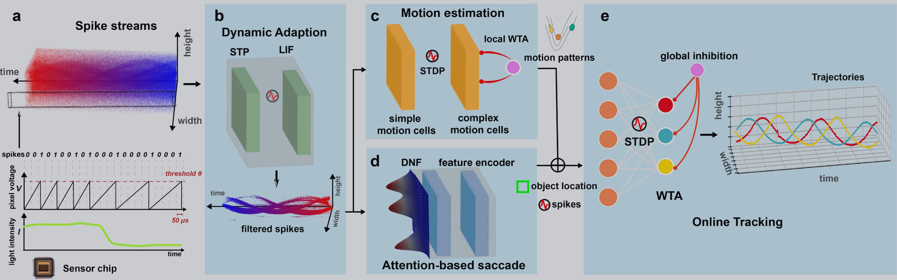

SNNTracker：基于脉冲神经网络的多目标跟踪 
^^^^^^^^^^^^^^^^^^^^^^^^^^^^^^^^^^^^^^^^^^^^^^^^

``spkProc.tracking.SNN_Tracker.snn_tracker``\ 中包含基于脉冲神经网络（Spiking Neural Network, SNN）的多目标跟踪算法\ ``SNNTracker``\ 。SNN_Tracker的跟踪框架如下图所示：

.. TODO: 其核心算法思想是通过结合STP滤波器、动态神经场（DNF）、STDP聚类和运动估计等多个模块，实现面向脉冲相机的多目标跟踪。
.. SNN_Tracker框架包含以下核心模块：
.. * ``动态适应层``\ ：STP脉冲滤波器，用于过滤出脉冲流中的运动物体
.. * ``检测层``\ ：基于动态神经场（DNF）的运动物体检测器，用于找到不同的运动物体
.. * ``聚类层``\ ：基于STDP的物体聚类模块，用于将检测到的运动物体进行聚类和跟踪
.. * ``运动估计层``\ ：基于STDP的运动估计模块，用于估计物体的运动向量

使用SNN_Tracker算法可先通过实例化\ ``spkProc.tracking.SNN_Tracker.snn_tracker``\ 中的\ ``SNNTracker``\ 类，其采用的数据类型为 *pytorch* 的张量形式，初始化时需提供脉冲阵列的高度\ ``spike_h``\ ，宽度\ ``spike_w``\ ，处理器\ ``device``\ ，以及可选的注意力区域大小\ ``attention_size``\ 和差分时间\ ``diff_time``\ 。例如，通过以下例子进行创建跟踪实例：

.. code-block:: python

   from spkProc.tracking.SNN_Tracker.snn_tracker import SNNTracker
   import torch

   device = torch.device('cuda')
   # spikes为使用SpikeStream实例获得的脉冲流矩阵
   spike_tracker = SNNTracker(spike_h=250, spike_w=400, device=device, attention_size=20)

SNNTracker类中的变量
~~~~~~~~~~~~~~~~~~~~~

``snn_tracker.py``\ 中SNN跟踪器对应的类\ ``SNNTracker``\ 具有以下几种变量：

* ``spike_h``\ ：脉冲阵列高度
* ``spike_w``\ ：脉冲阵列宽度
* ``device``\ ：所使用的处理器类型，\ ``cpu``\ 或者\ ``cuda``
* ``attention_size``\ ：attention窗口大小，默认为20
* ``diff_time``\ ：差分时间，用于STP滤波器的时间差分，默认为1
* ``stp_filter``\ ：STP脉冲滤波器，\ ``spkProc.filters.stp_filters_torch.STPFilter``\ 类的实例，对应动态适应层
* ``object_detection``\ ：运动物体检测器，\ ``spkProc.detection.attention_select.SaccadeInput``\ 类的实例，对应检测层
* ``motion_estimator``\ ：运动估计器，\ ``spkProc.motion.motion_detection.motion_estimation``\ 类的实例，对应运动估计层
* ``object_cluster``\ ：物体聚类器，\ ``spkProc.detection.stdp_clustering.stdp_cluster``\ 类的实例，对应聚类层
* ``calibration_time``\ ：校正时间步，在开始对运动物体进行检测跟踪前，运行滤波器以滤除冗余脉冲的步长，默认为150
* ``timestamps``\ ：当前处理的时间戳计数
* ``trajectories``\ ：存储跟踪轨迹的字典，键为跟踪ID，值为\ ``trajectories``\ 命名元组
* ``filterd_spikes``\ ：保留滤波器滤除后的脉冲流，可用于导出可视化的跟踪结果

SNNTracker类中的函数
~~~~~~~~~~~~~~~~~~~~~

``snn_tracker.SNNTracker``\ 中包含以下五个函数：

* ``calibrate_motion(spikes, calibration_time=None)``\ ：在开始跟踪前运行滤波器以滤除冗余脉冲，进行运动校准。该方法会根据指定的校正时长（或使用默认值）更新STP滤波器的状态。
* ``get_results(spikes, res_filepath, mov_writer=None, save_video=False)``\ ：执行多目标检测跟踪，并将结果保存至\ ``res_filepath``\ 中指定的 *txt* 文件中。该方法会遍历所有时间步，依次执行STP滤波、DNF检测、STDP聚类和运动估计，最终输出跟踪结果。
* ``_plot_timing_curve(timing_data, res_filepath)``\ ：绘制STDP跟踪的耗时曲线图，并将结果保存为PNG图片和CSV文件。该方法用于分析跟踪算法的性能。
* ``save_trajectory(results_dir, data_name)``\ ：保存跟踪轨迹到JSON文件。该方法会将所有跟踪对象的轨迹和边界框信息保存为JSON格式。

使用示例
~~~~~~~~

查看完整的使用示例，请参考：:ref:`_snntracker-usage`。

相关论文
~~~~~~~~

更多关于SNN_Tracker多目标跟踪算法的细节可参考论文：

#. Zheng Y, Li C, Zhang J, et al. SNNTracker: Online High-Speed Multi-Object Tracking With Spike Camera[J]. IEEE Transactions on Pattern Analysis and Machine Intelligence, 2026: 624-638.