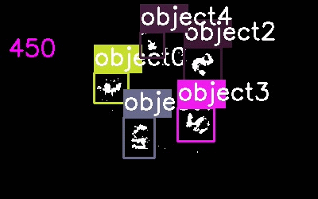
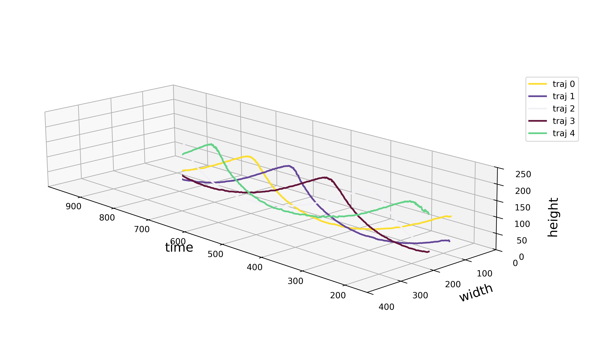

SNNTracker多目标跟踪算法示例
~~~~~~~~~~~~~~~
.. _snntracker-usage:

插入模块及数据加载
^^^^^^^^^^^^^^^^^^

使用\ ``motVidarReal2020``\ 数据集实现多目标跟踪的任务，并且使用标签数据及模型结果进行可视化和指标度量。对应的测试脚本为\ ``test_snntracker.py``\ ，具体实现过程为：

.. code-block:: python

   import argparse
   import cv2
   import os
   from utils import path
   import sys
   import torch
   import numpy as np
   from pprint import pprint
   from spkProc.tracking.SNN_Tracker.snn_tracker import SNNTracker
   from spkData.load_dat import data_parameter_dict, SpikeStream
   from utils.utils import vis_trajectory
   from visualization.get_video import obtain_mot_video
   from metrics.tracking_mot_v2 import TrackingMetrics  # for SNNTracker
   import pathlib
   from pathlib import Path

   # 指定数据集名称及任务类型
   data_filename = "motVidarReal2020/spike59"
   label_type = "tracking"

   # 记载数据集属性字典
   para_dict = data_parameter_dict(data_filename, label_type)
   pprint(para_dict)

   # 使用数据属性字典加载数据
   vidarSpikes = SpikeStream(**para_dict)
   block_len = 1000
   spikes = vidarSpikes.get_block_spikes(begin_idx=0, block_len=block_len)

若数据集加载成功，则终端会输出：

.. code-block:: basic

   {'filepath': '..\\spkData\\datasets\\motVidarReal2020\\spike59\\spikes.dat',
    'labeled_data_dir': '..\\spkData\\datasets\\motVidarReal2020\\spike59\\spikes_gt.txt',
    'labeled_data_suffix': 'txt',
    'labeled_data_type': [4, 5],
    'spike_h': 250,
    'spike_w': 400}
   loading total spikes from dat file -- spatial resolution: 400 x 250, begin index: 0 total timestamp: 1000

数据预处理
^^^^^^^^^^

可以对加载的脉冲数据进行降采样处理，以减少计算量并提高处理速度：

.. code-block:: python

   # 降采样比例（默认 1，不缩放）
   scale_w = 1 # 2
   scale_h = 1 # 2
   spikes = downscale_input(spikes, scale_w, scale_h)
   para_dict['spike_w'] = para_dict.get('spike_w') // scale_w
   para_dict['spike_h'] = para_dict.get('spike_h') // scale_h
   pprint(spikes.shape)

初始化SNNTracker
^^^^^^^^^^^^^^^^

使用\ ``spkProc.tracking.SNN_Tracker.snn_tracker.SNNTracker``\ 初始化跟踪器，并设置相关参数：

.. code-block:: python

   # 设置设备
   device = torch.device('cuda' if torch.cuda.is_available() else 'cpu')
   print(f"Using device: {device}")

   # 初始化SNNTracker
   attention_size = 15
   tracker = SNNTracker(
       spike_h=spike_h,
       spike_w=spike_w,
       device=device,
       attention_size=attention_size
   )

   print(f"SNNTracker initialized with spike_h={spike_h}, spike_w={spike_w}")

运动标定
^^^^^^^^

使用STP滤波器进行运动标定，以估计背景运动并提取前景目标：

.. code-block:: python

   # 标定时间
   calibration_time = 150

   print("Starting motion calibration...")
   tracker.calibrate_motion(spikes, calibration_time)
   print("Motion calibration completed.")

执行跟踪
^^^^^^^^

对整个数据序列进行多目标跟踪，并实时显示进度：

.. code-block:: python

   track_videoName = "Result/motVidarReal2020_spike59_snn.avi"
   tracking_file = "Result/motVidarReal2020_spike59_snn.txt"

   print("Starting tracking...")
   mov = cv2.VideoWriter(track_videoName, cv2.VideoWriter_fourcc(*'MJPG'), 30, (para_dict.get('spike_w'), para_dict.get('spike_h')))
   tracker.get_results(spikes[calibration_time:], tracking_file, mov, save_video=True)
   print(f"Tracking completed")

   mov.release()
   cv2.destroyAllWindows()

轨迹可视化
^^^^^^^^^^

.. code-block:: python

   trajectories_filename = "Result/motVidarReal2020_spike59_py.json"
   visTraj_filename = "Result/motVidarReal2020_spike59.png"

   # 可视化轨迹
   tracker.save_trajectory("Result", "spike59")
   vis_trajectory(trajectories_filename, visTraj_filename, **para_dict)

   print(f"Trajectory visualization saved to: {trajectory_filename}")

结果度量
^^^^^^^^

使用\ ``metrics.tracking_mot_v2.TrackingMetrics``\ 对跟踪结果进行评估：

.. code-block:: python

   # 计算跟踪指标
   metrics = TrackingMetrics(tracking_file, **para_dict)
   metrics.get_results()

度量结果示例：

.. code-block:: basic

      IDF1   IDP   IDR  Rcll  Prcn GT MT PT ML  FP FN IDs  FM  MOTA  MOTP IDt IDa IDm
full 95.8% 92.9% 98.8% 98.8% 92.9%  5  5  0  0 301 47   0  28 91.3% 0.418   0   0   0
part   NaN   NaN   NaN   NaN   NaN  0  0  0  0   0  0   0   0   NaN   NaN   0   0   0

视频可视化
^^^^^^^^^^

使用\ ``visualization.get_video.obtain_mot_video``\ 生成跟踪结果视频：

.. code-block:: python

   # 生成可视化视频
   video_filename = "Result/motVidarReal2020_spike59_mot.avi"
   obtain_mot_video(
       spikes,
       video_filename,
       tracking_file,
       **para_dict
   )
   print(f"Tracking video saved to: {video_filename}")

   # 如果要在STP滤波后的脉冲阵列上可视化跟踪结果，可使用：
   # obtain_mot_video(tracker.filtered_spikes, video_filename, tracking_file, **para_dict)

可视化结果示例
^^^^^^^^^^^^^^^

* 实时跟踪视频输出

* 视频可视化结果

* 轨迹可视化结果

参数配置和性能优化
-----------------

详细的参数配置说明、调优建议和性能优化技巧，请参考：

**SNNTracker 参数配置指南** (Markdown 格式)

- 📋 主要参数说明（基本参数、STP滤波器、DNF、STDP聚类、运动估计）
- ⚙️ 参数调优建议（根据场景特点、硬件配置、参数敏感性分析）
- 🚀 性能优化建议（GPU加速、降采样、批量处理、输出优化）
- 🔧 参数调试技巧（网格搜索、可视化、日志记录）
- 📊 性能基准（参考性能指标、硬件需求基准）
- 🎯 快速配置指南（快速原型、最终评估、资源受限）
- 🔍 故障排除（常见问题及解决方案）

该文档提供了完整的参数配置指南，帮助您在不同应用场景下获得最佳跟踪性能。

相关链接
--------

- **参数配置文档**: `../../SNN_TRACKER_PARAMETERS.md`_
- **SNNTracker 论文**: Zheng Y, Li C, Zhang J, et al. SNNTracker: Online High-Speed Multi-Object Tracking With Spike Camera[J]. IEEE Transactions on Pattern Analysis and Machine Intelligence, 2026: 624-638.
- **GitHub 项目**: https://github.com/Zyj061/snnTracker
- **SpikeCV 项目**: https://github.com/Zyj061/SpikeCV

.. _../../SNN_TRACKER_PARAMETERS.md: ../../SNN_TRACKER_PARAMETERS.md