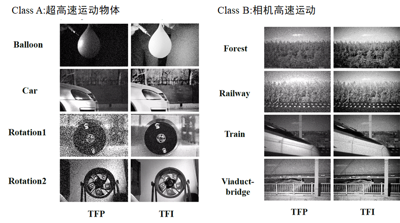
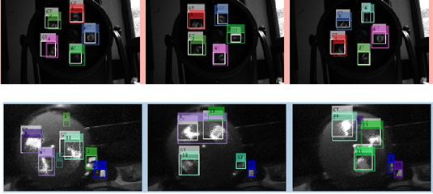
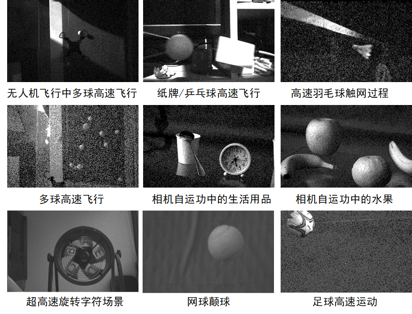
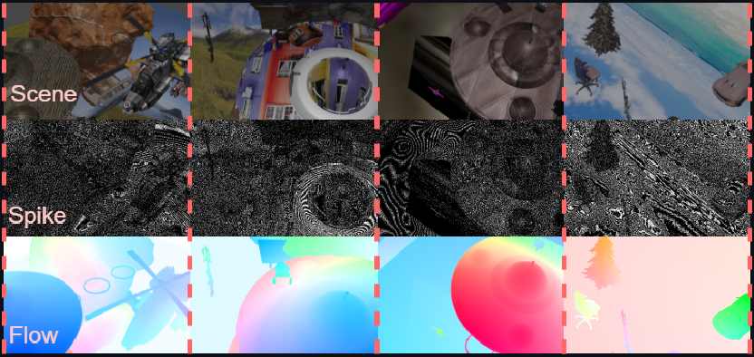
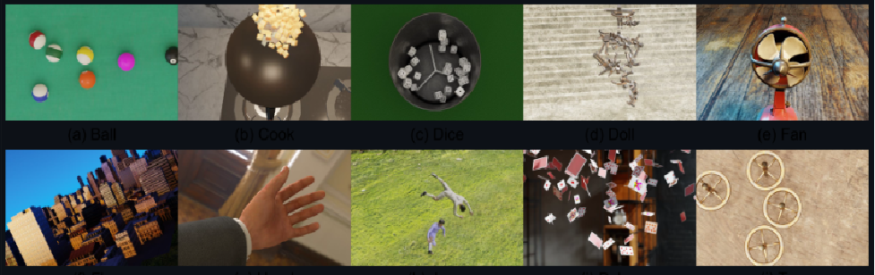
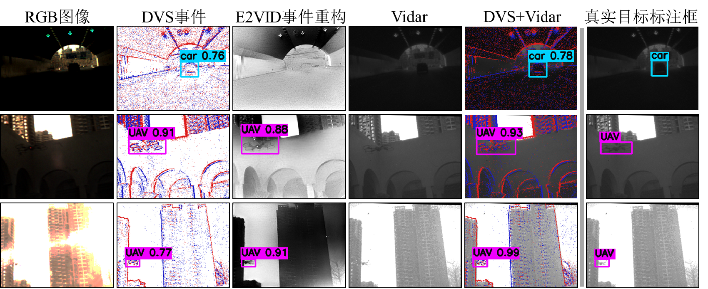
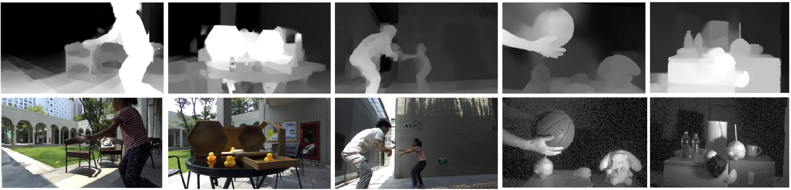

脉冲相机数据集
==============

1. ``recVidarReal2019``\ 数据集
---------------------------------

Vidar相机高速运动数据集。包括超高速运动物体（ClassA）和相机高速运动（ClassB）两类场景。其场景样例如下图所示：

2. ``motVidarReal2020``\ 数据集
---------------------------------

脉冲相机真实拍摄的多目标检测跟踪数据集，带有标签数据，可用于多目标运动物体的检测跟踪任务。

3. ``momVidarReal2021``\ 数据集
---------------------------------

Multi-Object-Motion 脉冲数据集：51段真实场景脉冲序列；提供多种物体运动模式和高速运行场景下的实拍Vidar脉冲流，种类丰富，速度较快；可用于脉冲图像重构、高速目标检测跟踪、运动分析(运动分割、光流估计)等任务。

4. ``OpticalFlowSPIFT``\ 数据集
---------------------------------

模拟多种飞行物体Spike flything things （SPIFT）场景，带有高速移动目标的光流数据，可应用于高速场景重构、高速目标检测跟踪、运动分析等任务（如光流估计等）。

5. ``OpticalFlowPHM``\ 数据集
-------------------------------

模拟真实场景高速运动Photo-realistic High-speed Motion（PHM）场景，带有高速移动目标的光流数据，可应用于高速场景重构、高速目标检测跟踪、运动分析等任务（如光流估计等）。

6. ``PKU-Vidar-DVS``\ 数据集
------------------------------

联合事件相机DVS和脉冲相机Vidar脉冲流的数据集，脉冲相机提供高速纹理采样，事件相机进行高速动态采样，提供12Meps的事件流, 25 Hz RGB图像（346 x 260）。该数据集提供候选框标注数据，可用于高速与极端光照场景下目标精准检测的任务。

7. ``PKU-Spike-Stereo``\ 数据集
---------------------------------

双目脉冲相机结合深度数据，提供Vidar脉冲流和ZED深度图，包含室内室外的高速运动场景，10类目标，887个深度标注图。

