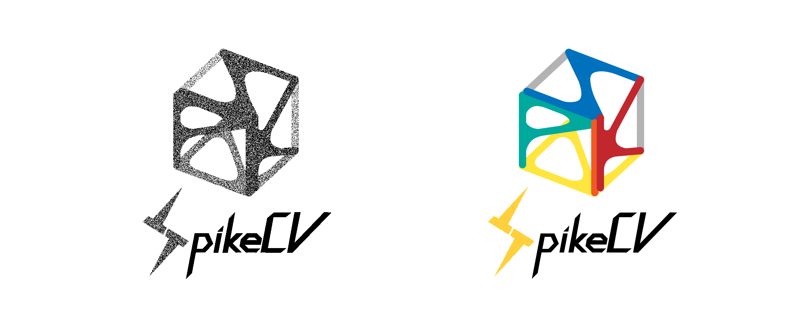
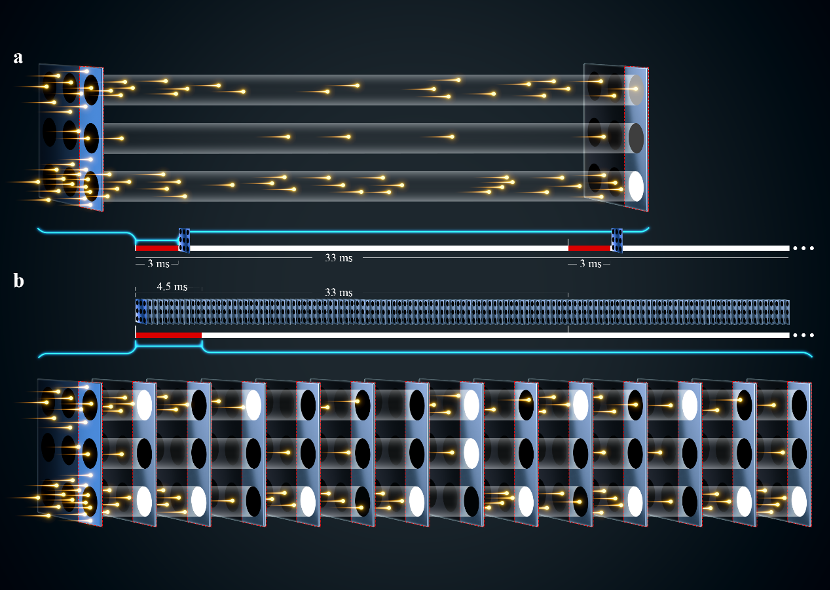
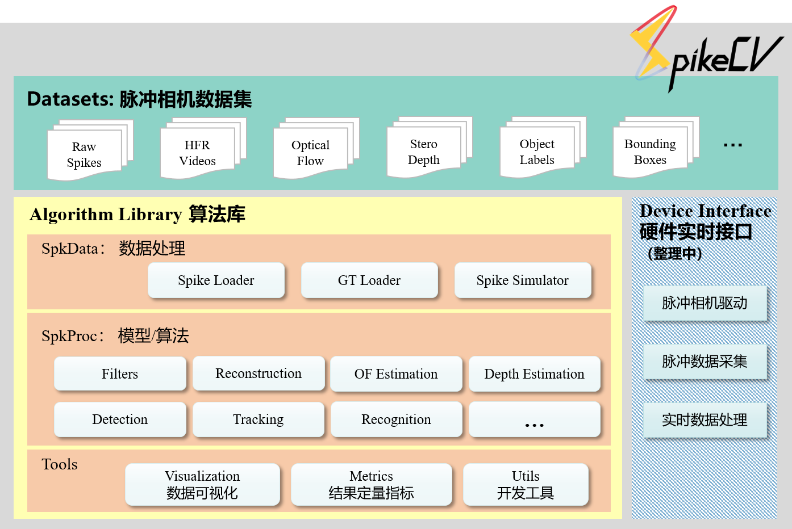

.. SpikeCV documentation master file, created by
   sphinx-quickstart on Mon Sep 19 15:54:52 2022.
   You can adapt this file completely to your liking, but it should at least
   contain the root `toctree` directive.
   

面向超高速脉冲相机的开源视觉框架 —— **SpikeCV**

..

    ”我们不仅提供锤子，还制造钉子，捕光制电，让我们打开前所未见的视觉新世界。 “

简介
===============

脉冲相机
^^^^^^^^

超高速脉冲相机模拟灵长类视网膜编码原理，每个像素位置直接根据光强变化独立发放脉冲。如下图(b)中显示，当光子累计达到预先设定好的阈值时就产生脉冲比特流，1表示发放脉冲，0表示无脉冲。与图(a)中展示的传统相机成像区别是，常见的数码相机按照一个较低的固定频率产生静止图片序列，无法有效记录光的高速变化过程，例如拍摄场景存在高速运动时，产生的图片会存在运动模糊。而脉冲相机目前可按照40KHZ的频率将光信号转化为脉冲比特流，记录的视觉时空变化较为完整，可应用超高速视觉场景的采集、表示、编码、检测、跟踪和识别等任务。 

..

   上图出自论文：Huang T, Zheng Y, Yu Z, et al. 1000× Faster Camera and Machine Vision with Ordinary Devices[J]. Engineering, 2022. 更多关于脉冲相机的细节请参考这篇文章。 

SpikeCV 架构
===============

如上图所示，SpikeCV主要包含三个部分：

#. **Datasets 脉冲相机数据集**\ ：

   * Raw Spikes：由脉冲相机产生或模拟器生成的脉冲流
   * HFR Videos：与脉冲流对应的高帧率视频流（High-Frame-Rate Videos, HFR)，可用于检验基于脉冲相机的超高速场景重构算法
   * Optical Flow：拍摄/模拟场景的光流信息
   * Stero Depth：双目、单目脉冲相机拍摄场景的深度信息
   * Object Labels：场景中物体的类别标签信息
   * Bounding Boxes：表示运动/前景物体所在位置及大小的候选框，可用于检测、跟踪等任务

#. **Algorithm Library 算法库**\ ：

   * SpkData：主要用于加载脉冲数据、加载与脉冲流对应的标签数据（Ground Truth, GT）和脉冲相机的简易模拟器
   * SpkProc：面向脉冲相机的模型及算法，包含\ *Filters滤波器*\ 、\ *Reconstrution重构算法*\ 、\ *OF Estimation光流估计*\ 、\ *Depth Estimation深度估计*\ 、\ *Deteciton 物体检测*\ 、\ *Tracking多目标跟踪* 和\ *物体识别* 等模块
   * Tools：工具类接口，包含：

     * ``Visualization`` —— 脉冲流或各类视觉任务结果的可视化
     * ``Metrics`` —— 各类视觉任务结果的定量评价指标
     * ``Utils`` ——  辅助开发工具，例如数据路径处理等

#. **Device Interface 硬件实时接口**\ ：提供脉冲相机驱动及配套的数据采集，实时数据处理接口。可支持用于目前已发行的脉冲相机，相关代码正在整理中。

安装说明
===============

安装
^^^^

建议使用\ `Anaconda <https://www.anaconda.com/>`_\ 创建专属于 ``SpikeCV`` 的使用环境

.. code-block:: bash

   # 从启智平台下载代码仓库
   git clone https://git.openi.org.cn/Cordium/SpikeCV.git 
   cd SpikeCV
   python setup.py install
   

数据集
===============

``SpikeCV`` 脚本的运行依赖于开源框架的数据集，因此请确保所执行任务对应的数据集下载成功，可通过网页下载或是通过命令行从指定的数据集链接下载，例如：

.. code-block:: bash

   cd SpikeCV\SpkData\datasets
   wget -c SpikeCV数据集的网页链接 -O | tar -xz

对于较大的数据集，建议直接从启智SpikeCV仓库的\ `数据集地址 <https://git.openi.org.cn/Cordium/SpikeCV/datasets>`_\ 下载，并将数据集文件夹解压缩到\ ``SpikeCV\SpkData\datasets`` 目录下。 

接口使用教程
===============

.. toctree::
   :maxdepth: 2
   
   datasets
   数据加载
   硬件接口
   核心操作
   数据处理工具箱
   使用例子   
   Publications

引用方式
===============

.. code-block:: bib

   @misc{SpikeCV,
       title = {SpikeCV},
       author = {Zheng, Yajing and Zhang, Jiyuan and Zhao Rui and Ding, Jianhao and Li, Jianing and Chen, Shiyan and Yu, Zhaofei, Huang, Tiejun and other contributors},
       year = {2022},
       howpublished = {\url{https://git.openi.org.cn/Cordium/SpikeCV.git}},
   }

更多脉冲相机的相关文章请参见 `Publications.md <https://git.openi.org.cn/Cordium/SpikeCV/src/branch/master/Publications.md>`_\ 。

若有问题可通过以下邮箱进行咨询：

* spikecv@outlook.com

开源许可证
===============

SpikeCV 开源项目是在\ ``Apache2.0许可证``\ 下授权的，请参考\ `License.md <https://git.openi.org.cn/Cordium/SpikeCV/src/branch/master/License.md>`_\ 查阅许可详情。

开发单位
===============

**SpikeCV**\ 是由北京大学\ **视频与视觉技术国家工程研究中心**\ 牵头组织的开源项目。
