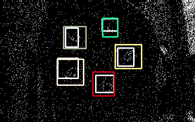
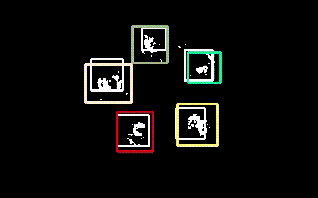

使用例子
========

在本节教程中，我们将示范如何使用提供的接口结合数据集实现各种任务。所有测试例子都可在\ ``examples``\ 目录下找到对应脚本。

..

   注意：在进行测试前，请先确保本地项目目录\ ``SpikeCV.spkData.datasets``\ 下有已经解压的对应数据集，并且指定数据时需具体指定到场景名称。

超高速运动场景纹理重构算法
--------------------------

TFI重构算法
^^^^^^^^^^^

使用\ ``recVidarReal2019``\ 数据集中的汽车高速行驶的场景序列\ ``car-100kmh``\ 进行重构，对应的测试脚本为\ ``test_tfi.py``\ ，其数据读取的过程与上述TFP重构算法的数据读取相同

使用\ ``spkProc.reconstruction.tfp.TFP``\ 进行重构并将结果输出保存至视频文件

.. code-block:: python

   device = torch.device('cpu')
   reconstructor = TFP(paraDict.get('spike_h'), paraDict.get('spike_w'), device)

   st = time.time()
   recImg = reconstructor.spikes2images(spikes, half_win_length=20)
   ed = time.time()
   print('shape: ', recImg.shape, 'time: {:.6f}'.format(ed - st))

   filename = path.split_path_into_pieces(data_filename)
   if not os.path.exists('results'):
       os.makedirs('results')

   result_filename = os.path.join('results', filename[-1] + '_tfp.avi')
   obtain_reconstruction_video(recImg, result_filename, **paraDict)

重构结果：

.. image:: ./media/car_reconstruction_tfi.gif
   :target: ./media/car_reconstruction_tfi.gif
   :alt: car-100kmh_tfi

TFP重构算法
^^^^^^^^^^^

使用\ ``recVidarReal2019``\ 数据集中的汽车高速行驶的场景序列\ ``car-100kmh``\ 进行重构，对应的测试脚本为\ ``test_tfp.py``\ ，其具体实现过程为：

.. code-block:: python

   import os
   import torch
   import sys
   sys.path.append("..")

   import time

   from spkData.load_dat import data_parameter_dict
   from spkData.load_dat import SpikeStream
   from spkProc.reconstruction.tfp import TFP
   from visualization.get_video import obtain_reconstruction_video
   from utils import path

   # 指定数据序列及任务类型
   data_filename = "recVidarReal2019/classA/car-100kmh"
   label_type = 'raw'

   # 加载数据集属性字典
   paraDict = data_parameter_dict(data_filename, label_type)

   #加载脉冲数据
   vidarSpikes = SpikeStream(**paraDict)

   block_len = 500
   spikes = vidarSpikes.get_block_spikes(begin_idx=0, block_len=block_len)

使用\ ``spkProc.reconstruction.tfp.TFP``\ 进行重构并将结果输出保存至视频文件

.. code-block:: python

   device = torch.device('cpu')
   reconstructor = TFP(paraDict.get('spike_h'), paraDict.get('spike_w'), device)

   st = time.time()
   recImg = reconstructor.spikes2images(spikes, half_win_length=20)
   ed = time.time()
   print('shape: ', recImg.shape, 'time: {:.6f}'.format(ed - st))

   filename = path.split_path_into_pieces(data_filename)
   if not os.path.exists('results'):
       os.makedirs('results')

   result_filename = os.path.join('results', filename[-1] + '_tfp.avi')
   obtain_reconstruction_video(recImg, result_filename, **paraDict)

重构结果：

.. image:: ./media/car_reconstruction_tfp.gif
   :target: ./media/car_reconstruction_tfp.gif
   :alt: car-100kmh_tfp

TFSTP重构算法
^^^^^^^^^^^^^

使用\ ``recVidarReal2019``\ 数据集中的汽车高速行驶的场景序列\ ``car-100kmh``\ 进行重构，对应的测试脚本为\ ``test_tfstp.py``\ ，其具体实现过程为：

.. code-block:: python

   import os, sys
   import torch
   sys.path.append('..') 

   from spkData.load_dat import data_parameter_dict
   from spkData.load_dat import SpikeStream
   from spkProc.reconstruction.tfstp import TFSTP
   from visualization.get_video import obtain_reconstruction_video
   from utils import path
   from pprint import pprint

   # 指定数据序列及任务类型
   data_filename = 'recVidarReal2019/classA/car-100kmh'
   label_type = 'raw' # 没有标签数据的数据集，任务类型只能指定为raw

   # 加载数据集属性字典
   paraDict = data_parameter_dict(data_filename, label_type)
   pprint(paraDict)

   #加载脉冲数据
   vidarSpikes = SpikeStream(**paraDict)
   block_len = 1500
   spikes = vidarSpikes.get_block_spikes(begin_idx=500, block_len=block_len)

数据集记载成功后终端会输出：

.. code-block:: basic

   {'filepath': '..\\spkData\\datasets\\recVidarReal2019\\classA\\car-100kmh',
    'spike_h': 250,
    'spike_w': 400}
   loading total spikes from dat file -- spatial resolution: 400 x 250, begin index: 500 total timestamp: 1500

使用\ ``spkProc.reconstruction.tfstp.TFSTP``\ 进行重构并将结果输出保存至视频文件

.. code-block:: python

   device = torch.device('cuda')
   reconstructor = TFSTP(paraDict.get('spike_h'), paraDict.get('spike_w'), device)
   recImg = reconstructor.spikes2images_offline(spikes)

   filename = path.split_path_info_pieces(data_filename)
   if not os.path.exists('results'):
       os.makedirs('results')

   result_filename = os.path.join('results', filename[-1] + '_tfstp.avi')
   obtain_reconstruction_videos(recImg, result_filename, **paraDict)

重构结果：

.. image:: ./media/car-100kmh_tfstp.gif
   :target: ./media/car-100kmh_tfstp.gif
   :alt: car-100kmh_tfstp

SSML重构算法
^^^^^^^^^^^^^
``example``\ 中的\ ``train_ssml_recon.py``\ 与\ ``test_ssml_recon.py``\ 分别提供了\ ``SSML_ReconNet``\ 网络训练与测试的样例。

其中，测试时，直接读取.dat文件，截取41个时间步送入预训练网络，即可生成对其中心帧的重构图。

训练时，需要准备数据集文件夹。文件夹结构按照\ ``dataset_name\input\*.dat``\ 的形式组织。调整训练文件的参数，或者直接运行训练文件以默认参数进行训练。由于SSML重构算法用于没有GroundTruth的真实场景重构，所以没有PSNR指标。用户可以在若干小时后使用保存的中间模型权重来进行测试，查看是否达到了预期的重构结果。

SRR超分重构算法
^^^^^^^^^^^^^
``example``\ 中的\ ``test_SRR.py``\ 提供了\ ``SRR_moedl``\ 网络测试的样例。

本算法需要安装 Pyflow（https://github.com/pathak22/pyflow）依赖库，用于计算光流。

克隆仓库后，执行以下命令：（对于Windows系统，还需要将pyflow/src/project.h中的 #define _LINUX_MAC 语句注释掉。）

cd pyflow/

python setup.py build_ext -i

随后将生成的.pyd文件（Windows系统）或.so文件（Linux系统）复制到工作目录下。

测试时，直接读取.dat文件，截取240个时间步送入预训练网络，即可生成超分图。

光流估计
--------

``example``\ 中的\ ``train_scflow.py``\ 与\ ``test_scflow.py``\ 分别提供了\ ``SCFlow``\ 网络训练与测试的样例。

.. code-block:: python

   # train_scflow.py 中的代码介绍

   # main函数结构介绍

   ######################## Train Loader ########################
   ## 定义训练集合的代码

   ######################## Test Loader ########################
   ## 定义验证集合

   ######################## Create Saving Root ########################
   ## 定义保存训练结果的文件夹与writer

   ######################## Create Model ########################
   ## 初始化模型

   ######################## Create Optimizer ########################
   ## 创建优化器

   ######################## Training Loop ########################
   ## 逐个epoch训练调用train()函数的循环

   # train函数结构介绍

   ######################## Define params and model.train() ########################
   ## 定义参数并将model设置为train模式

   ######################## Get inputs ########################
   ## 获取minibatch的输入

   ######################## Compute output ########################
   ## 计算网络的输出

   ######################## Compute loss ########################
   ## 计算损失函数

   ######################## Compute gradient and optimize ########################
   ## 计算梯度并反向传播

   ######################## Record loss and output logs ########################
   ## 记录损失并输出训练日志

   # validate函数的结构的前半部分与train类似（不同的是model为eval模式），在计算网络输出后对所输出的光流进行评价记录、打印日志

   # test_scflow.py 的函数结构与上述validate函数类似，可通过设置scene变量选择PHM数据集的场景

多目标高速运动物体跟踪
----------------------

使用\ ``motVidarReal2020``\ 数据集实现多目标跟踪的任务，并且使用标签数据及模型结果进行可视化和指标度量。对应的测试脚本为\ ``test_ssort.py``\ ，具体实现过程为：

插入模块及数据加载
^^^^^^^^^^^^^^^^^^

.. code-block:: python

   import os, sys
   import torch
   sys.path.append("..")  #若是在example目录下，需添加父级目录路径

   from spkData.load_dat import data_parameter_dict
   from spkData.load_dat import SpikeStream
   from spkProc.tracking.spike_sort import SpikeSORT
   from utils import path

   from metrics.tracking_mot import TrackingMetrics
   from visualization.get_video import obtain_mot_video
   from pprint import pprint

   # 指定数据集名称及任务类型
   data_filename = "motVidarReal2020/spike59"
   label_type = "tracking"

   # 记载数据集属性字典
   paraDict = data_parameter_dict(data_filename, label_type)
   pprint(paraDict)

   # 使用数据属性字典加载数据
   vidarSpikes = SpikeStream(**paraDict)
   block_len = 1000
   spikes = vidarSpikes.get_block_spikes(begin_idx=0, block_len=block_len)

若数据集加载成功，则终端会输出：

.. code-block:: basic

   {'filepath': '..\\spkData\\datasets\\motVidarReal2020\\spike59\\spikes.dat',
    'labeled_data_dir': '..\\spkData\\datasets\\motVidarReal2020\\spike59\\spikes_gt.txt',
    'labeled_data_suffix': 'txt',
    'labeled_data_type': [4, 5],
    'spike_h': 250,
    'spike_w': 400}
   loading total spikes from dat file -- spatial resolution: 400 x 250, begin index: 0 total timestamp: 1000

进行多目标跟踪并保存结果到文本文件
^^^^^^^^^^^^^^^^^^^^^^^^^^^^^^^^^^

使用\ ``spkProc.tracking.spike_sort``\ 中的多目标跟踪器\ ``SpikeSORT``\ ，并且输出结果到\ ``txt``\ 文本文件中

.. code-block:: python

   device = torch.device('cuda')

   calibration_time = 150
   filename = path.split_path_info_pieces(data_filename)
   result_filename = filename[-1] + '_spikeSort.txt'
   # 确保文件保存路径存在
   if not os.path.exists('results'):
       os.makedirs('results')
   tracking_file = os.path.join('results', result_filename)
   # 实例化 SpikeSORT用于多目标跟踪
   spike_tracker = SpikeSORT(spikes, paraDict.get('spike_h'), paraDict.get('spike_w'), device)

   spike_tracker.calibrate_motion(calibration_time)
   spike_tracker.get_results(tracking_file)

若成功运行，终端中会出现跟踪所消耗的总时长：

.. code-block:: basic

   begin calibrate..
   Total tracking took: 4.090 seconds for 850 timestamps spikes

结果度量及可视化
^^^^^^^^^^^^^^^^

.. code-block:: python

   # 多目标跟踪结果度量
   metrics = TrackingMetrics(tracking_file, **paraDict)
   metrics.get_results()

   # 可视化多目标跟踪结果
   video_filename = os.path.join('results', filename[-1] + 'mot.avi')
   # 在滤波后的脉冲阵列上可视化跟踪结果
   obtain_mot_video(spike_tracker.filterd_spikes, video_filename, tracking_file, **paraDict)
   # 若是在原始脉冲阵列上可视化跟踪结果，可采取
   # obtain_mot_video(spikes, video_filename, tracking_file, **paraDict)

度量结果：

.. code-block:: basic

         IDF1   IDP   IDR  Rcll  Prcn GT MT PT ML  FP  FN IDs  FM  MOTA  MOTP IDt IDa IDm
   full 93.6% 91.0% 96.5% 96.5% 91.0%  5  5  0  0 383 141   0  36 86.9% 0.465   0   0   0
   part  nan%  nan%  nan%  nan%  nan%  0  0  0  0   0   0   0   0  nan%   nan   0   0   0

可视化结果：

* 在原始脉冲阵列上可视化跟踪结果，白色边框为标签数据，彩色边框为算法结果，不同颜色表示不同的跟踪器。

* 在STP滤波后的脉冲阵列上的可视化跟踪结果

