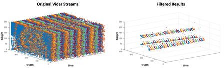
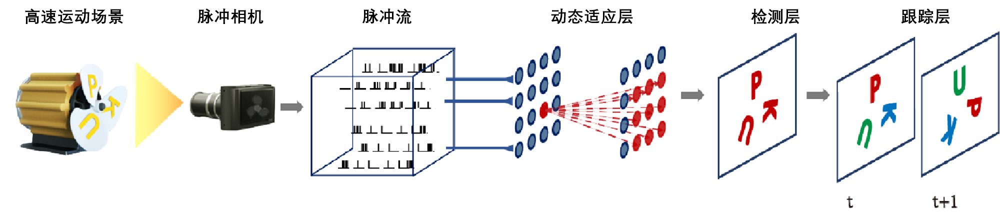
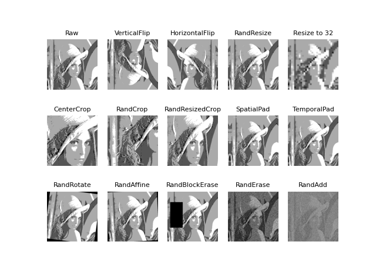

算法库
====================

脉冲流处理，及面向各类视觉任务的算法.

.. raw:: html

   

滤波器
------

``SpikeCV.spkProc.filters``\ 中的脉冲流滤波接口。

STP 滤波器
^^^^^^^^^^

在\ `README.md <https://git.openi.org.cn/Cordium/SpikeCV/src/branch/master/README.md>`_\ 中我们介绍了脉冲相机产生脉冲比特流的原理，可简单概述为在每个像素位置光强越强，脉冲发放越快。为了分析每个像素位置的脉冲流信息，我们在每个脉冲像素位置引入了\ ``STP滤波器``\ 来自适应地根据脉冲流信息更新状态。

 STP滤波器是基于神经计算中的短时程可塑性模型（Short-term Plasticity)设计的，其通过差分方程进行更新：

.. math::
    R_{n+1}&=1-[1-R_n(1-u_n)]\exp \left(-\frac{\Delta t_n}{\tau\ *D} \right),\\
    u_{n+1}&=U+[u_n+C(1-u_n)-U]\exp \left(-\frac{\Delta t_n}{\tau_F} \right)

根据上述公式，变量 :math:`R` 和 :math:`u` 将在每次脉冲间隔 :math:`\Delta t_n` 发生变化时进行更新。 目前\ ``SpikeCV``\ 中提供了两种STP滤波器的实现方式，一种是\ ``spkProc.filters.stp_filters.py``\ 中基于\ *numpy*\ 的数组形式，另外一种是\ ``spkProc.filters.stp_filters_torch.py``\ 中基于\ *pytorch*\ 中的张量形式。两个接口中除了数据形式的差别，函数与变量定义基本一致。因此，我们将主要介绍\ ``spkProc.filters.stp_filters_torch.py``\ 中的STP滤波器的变量含义及内嵌函数功能。\ ``stp_filters_torch.py``\ 中STP滤波器的创建方式为：

.. code-block:: python

   from spkProc.filters.stp_filters_torch import STPFilter

   #第一种创建方式：使用默认的STP的参数设置
   stp_filter = STPFilter(spike_h, spike_w, device)

   #第二种创建方式：自定义STP参数 stpPara
   stpPara = {}
   stpPara['u0'] = 0.15
   stpPara['D'] = 0.05 * 20
   stpPara['F'] = 0.5 * 20
   stpPara['f'] = 0.15
   stpPara['time_unit'] = 1

   stp_filter = STPFilter(spike_h, spike_w, device, **stpPara)

STPFilter类中的变量
~~~~~~~~~~~~~~~~~~~

``stp_filters_torch.py``\ 中STP滤波器对应的类\ ``STPFilter``\ 具有以下几种变量：

* ``spike_h``\ ：脉冲阵列高度
* ``spike_w``\ ：脉冲阵列宽度
* ``device``\ ：所使用的处理器类型，\ ``cpu``\ 或者\ ``cuda``
* ``u0``\ ，\ ``D``\ ，\ ``F``\ ，\ ``f``\ ，\ ``time_unit``\ 和 :math:`r_0`：STP模型的相关参数；前四位分别对应上述公式中 :math:`U，\tau_D，\tau_F，C`变量，\ ``time_unit``\ 表示脉冲间隔时间单位，:math:`r_0` 为 :math:`R` 的初始值
*  :math:`R,u,r_{old}`：记录每个像素位置的 :math:`R`和 :math:`u`，还有用于记录未更新状态 :math:`R`的 :math:`r_{old}`，它们的形状与脉冲阵列的形状一致，都为 :math:`(spike_h, spike_w)`
* ``detectVoltage``\ ，\ ``lifConv``\ 和\ ``lif_spk``\ ：与LIF神经元更新相关的变量，用于增强空间滤波效果
* ``filter_spk``\ ：STP滤波处理后的脉冲阵列，形状为 :math:`(spike_h, spike_w)`
* ``spikePrevMnt``\ ：当前时刻之前的最近脉冲发放时刻，形状为 :math:`(spike_h,spike_w)`

STPFilter类中的函数
~~~~~~~~~~~~~~~~~~~

``stp_filters_torch.STPFilter``\ 中包含以下三个函数：

#. 
   ``update_dynamics(curT, spikes)``\ ：根据\ ``curT``\ 时刻的脉冲阵列\ ``spikes``\ 更新STP模型变量 :math:`R,u,r_{old}`及\ ``filter_spk``

   其调用方式如下：

   .. code-block:: python

      from spkProc.filters.stp_filters_torch import STPFilter
      import torch

      device = torch.device('cuda') # 使用gpu
      stp_filter = STPFilter(spike_h=250, spike_w=400, device=device)
      for t in range(timestamps):
          # spikes 是通过spkData.load_dat.SpikeStream对象获得的脉冲流
          input_spike = torch.from_numpy(spikes[t, :, :]).to(device)
          stp_filter.update_dynamics(t, input_spike)

          # 可获得滤波后的t时刻的脉冲阵列，或变量R,u的值
          filter_spikes = stp_filter.filter_spk
          R = stp_filter.R
          u = stp_filter.u

#. 
   ``update_dynamic_offline(spikes, intervals)``\ ：根据传入的脉冲流，及对应的脉冲间隔获取每个时刻对应的STP模型变量值，函数最终返回 :math:`R，u`与输入参数\ ``spikes``\ 和\ ``intervals``\ 的形状一致，均为 :math:`(脉冲序列步长，spike_h,spike_w)`。调用\ ``update_dynamic_offline``\ 函数前需先计算出\ `脉冲间隔（inter-spike intervals, ISI) <https://www.tau.ac.il/~tsirel/dump/Static/knowino.org/wiki/Interspike_interval.html>`_\ 。

   调用方式如下：

   .. code-block:: python

      from spkProc.filters.stp_filters_torch import STPFilter
      from spkProc.reconstruction.tfstp import TFSTP

      device = torch.device('cuda')
      stp_filter = STPFilter(spike_h=250, spike_w=400, device=device)
      isi = TFSTP.spike2interval(spikes) # 调用TFSTP类的静态方法spike2interval获取脉冲间隔
      R, u = stp_filter.update_dynamic_offline(spikes, intervals)

#. 
   ``local_connect(spikes)``\ ：局部连接的LIF神经元，一般用于在\ ``update_dynamic``\ 在线更新STP模型状态后，获得滤波后的脉冲阵列\ ``stp_filter.filter_spk``\ 作为输入，在其基础上进行空间滤波，并将结果保存至类内变量\ ``lif_spk``\ 中。

   .. code-block:: python

      stp_filter.local_connect(stp_filter.filter_spk) #更新stp_filter.lif_spk的值

在使用\ ``update_dynamic``\ 和\ ``local_connect``\ 函数后，可获得原始脉冲阵列中运动区域部分对应的脉冲流，例如下图中，左侧为脉冲相机输出的脉冲流（vidar streams)，右图为经过STP滤波之后的结果：

..

   更多关于面向脉冲流的STP滤波器操作可参考论文：

   #. Huang T, Zheng Y, Yu Z, et al. 1000× Faster Camera and Machine Vision with Ordinary Devices[J]. Engineering, 2022. 
   #. Zheng Y, Zheng L, Yu Z, et al. High-speed image reconstruction through short-term plasticity for spiking cameras[C]//Proceedings of the IEEE/CVF Conference on Computer Vision and Pattern Recognition. 2021: 6358-6367. 

重构算法
--------

``SpikeCV.spkProc.reconstruction``\ 中的高速场景重构算法接口。

基于脉冲间隔的纹理重构算法TFI
^^^^^^^^^^^^^^^^^^^^^^^^^^^^^

``spkProc.reconstruction.tfi.py``\ 中基于脉冲间隔的纹理重构算法\ ``TFI``\ ，核心思想是通过各像素所处时刻相邻两次脉冲发放的间隔来推断光照强度。

使用TFI算法可先通过实例化\ ``skpProc.reconstruction.tfi.py``\ 中的\ ``TFI``\ 类，其所采用的数据类型为\ *pytorch*\ 的张量形式，定义时仅需传入脉冲阵列的高度\ ``spike_h``\ ，宽度\ ``spike_w``\ ，和所使用处理器\ ``device``\ 。

.. code-block:: python

   from spkProc.reconstruction.tfp import TFP
   import torch

   reconstructor = TFP(spike_h=250, spike_w=400, torch.device('cuda'))

TFI类中的变量
~~~~~~~~~~~~~

* ``spike_h``\ ：脉冲阵列高度
* ``spike_w``\ ：脉冲阵列宽度
* ``device``\ ：所使用的处理器类型，\ ``cpu``\ 或者\ ``cuda``

TFI类中的函数
~~~~~~~~~~~~~

* ``spikes2images（spikes, max_search_half_window=20）``\ ：将spikes整体转换为一段由TFI算法重构的图像。将传入的维度为\ ``(timesteps, spike_h, spike_w)``\ 的脉冲序列\ ``spikes``\ 转化为TFI的重构影像，其中TFI脉冲搜索的最大距离为前向后向各\ ``max_search_half_window``\ ，输出的图像的维度为\ ``(timesteps-(2 x max_search_half_window), spike_h, spike_w)``\ 。
* ``spikes2frame(spikes, key_ts, half_win_length=20)``\ ：从spikes中获取时刻\ ``key_ts``\ 由TFI算法重构的图像。输入spikes的维度为\ ``(timesteps, spike_h, spike_w)``\ ，TFI脉冲搜索的最大距离为前向后向各\ ``max_search_half_window``\ ，返回的图像维度为\ ``(spike_h, spike_w)``\ 。

基于滑动窗口脉冲发放率的纹理重构算法TFP
^^^^^^^^^^^^^^^^^^^^^^^^^^^^^^^^^^^^^^^

``spkProc.reconstruction.tfp.py``\ 中基于滑动窗口脉冲发放率的纹理重构算法\ ``TFP``\ ，核心思想是通过滑动窗口中各像素的脉冲发放率来对光照强度进行估计。

使用TFP算法可先通过实例化\ ``skpProc.reconstruction.tfp.py``\ 中的\ ``TFP``\ 类，其所采用的数据类型为\ *pytorch*\ 的张量形式，定义时仅需传入脉冲阵列的高度\ ``spike_h``\ ，宽度\ ``spike_w``\ ，和所使用处理器\ ``device``\ 。

.. code-block:: python

   from spkProc.reconstruction.tfp import TFP
   import torch

   reconstructor = TFP(spike_h=250, spike_w=400, torch.device('cuda'))

TFP类中的变量
~~~~~~~~~~~~~

* ``spike_h``\ ：脉冲阵列高度
* ``spike_w``\ ：脉冲阵列宽度
* ``device``\ ：所使用的处理器类型，\ ``cpu``\ 或者\ ``cuda``

TFP类中的函数
~~~~~~~~~~~~~

* ``spikes2images（spikes, half_win_length）``\ ：将spikes整体转换为一段由TFP算法重构的图像。将传入的维度为\ ``(timesteps, spike_h, spike_w)``\ 的脉冲序列\ ``spikes``\ 转化为由窗口长度为( :math:`2 \times {\rm half_win_length}+1`)TFP算法重构的影像，输出的图像的维度为\ ``(timesteps-(2 x half_win_length), spike_h, spike_w)``\ 。
* ``spikes2frame(spikes, key_ts, half_win_length)``\ ：从spikes中获取时刻\ ``key_ts``\ 由TFP算法重构的图像。输入spikes的维度为\ ``(timesteps, spike_h, spike_w)``\ ，TFP算法的窗口长度为( :math:`2 \times {\rm half_win_length}+1`)，返回的图像维度为\ ``(spike_h, spike_w)``\ 。

基于短时程可塑性模型的纹理重构算法TFSTP
^^^^^^^^^^^^^^^^^^^^^^^^^^^^^^^^^^^^^^^

``spkProc.reconstruction.tfstp.py``\ 中基于STP模型构建的纹理重构算法\ ``TFSTP``\ ，核心思想是通过STP模型的变量值 :math:`R`和 :math:`u`推理每个像素位置的脉冲发放率，从而获得每个像素位置的纹理值。由于STP模型具有滤波的效果，因此效果比直接根据脉冲间隔或滑动窗口脉冲发放率的纹理重构算法（TFI和TFP）所具备的运动模糊和噪音都少。

使用TFSTP算法可先通过实例化\ ``spkProc.reconstruction.tfstp.py``\ 中的\ ``TFSTP``\ 类，其采用的数据类型为\ *pytorch*\ 的张量形式，定义时仅需传入脉冲阵列的高度\ ``spike_h``\ ，宽度\ ``spike_w``\ ，和所使用处理器\ ``device``\ 。

.. code-block:: python

   from spkProc.reconstruction.tfstp import TFSTP
   import torch

   reconstructor = TFSTP(spike_h=250, spike_w=400, torch.device('cuda'))

TFSTP类中的变量
~~~~~~~~~~~~~~~

* ``spike_h``\ ：脉冲阵列高度
* ``spike_w``\ ：脉冲阵列宽度
* ``device``\ ：所使用的处理器类型，\ ``cpu``\ 或者\ ``cuda``
* ``stpPara``\ ：STP模型的字典数据，包含关键词\ ``u0``\ ，\ ``D``\ ，\ ``F``\ ，\ ``f``\ 和\ ``time_unit``\ 用于初始化STP滤波器的参数值
* stp_filter：STP模型，为\ ``spkProc.filters.stp_filters_torch.STPFilter``\ 的实例

TFSTP类中的函数
~~~~~~~~~~~~~~~

* spike2interval(spikes)：TFSTP类的静态方法，可直接通过类名调用。将传入的维度为\ ``(timesteps, spike_h, spike_w)``\ 的脉冲序列\ ``spikes``\ 转化为脉冲间隔，函数返回的脉冲间隔维度也为\ ``(timesteps, spike_h, spike_w)``
* spikes2images_online(spikes)：使用STP滤波器中的在线更新方法\ ``update_dynamics(curT, spikes)``\ ，并且用每个时刻的STP滤波器变量\ ``stp_filter.R``\ 和\ ``stp_filter.u``\ 推理像素值
* ``spikes2images_offline(spikes)``\ ：使用STP滤波器的离线更新方法\ ``update_dynamic_offline(spikes, intervals)``\ ，并用该函数返回的\ ``R``\ 和\ ``u``\ 变量推理脉冲序列中每个时刻、每个像素位置的纹理值。

..

   更多关于TFSTP纹理重构算法的细节可参考论文：

   #. Zheng Y, Zheng L, Yu Z, et al. High-speed image reconstruction through short-term plasticity for spiking cameras[C]//Proceedings of the IEEE/CVF Conference on Computer Vision and Pattern Recognition. 2021: 6358-6367. 

基于自监督盲点网络的纹理重构算法SSML_Recon
^^^^^^^^^^^^^^^^^^^^^^^^^^^^^

``spkProc.reconstruction.SSML_Recon.ssml_recon.py``\ 包含了定义\ ``SSML_ReconNet``\ 所需的类与函数。

有关SSML_Recon的调用，请参考\ `使用例子 <https://git.openi.org.cn/Cordium/SpikeCV/src/branch/master/docs/examples.md>`_\ 中\ ``SSML_Recon``\ 的用例。

..

   更多关于SSML_Recon自监督重构算法的细节可参考论文: 

   #. Chen S, et al. Self-Supervised Mutual Learning for Dynamic Scene Reconstruction of Spiking Camera[C]//International Joint Conferences on Artificial Intelligence Organization. 2022: 2859--2866. 

光流估计
--------

``spkProc.optical_flow.SCFlow``\ 包含了定义\ ``SCFlow``\ 所需的类与函数，其中\ ``spkProc.optical_flow.SCFlow.scflow.get_scflow(data=None, batchNorm=False)``\ 函数可以获取\ ``SCFlow``\ 的模型，其中\ ``data``\ 参数为预先加载的模型权重，如果\ ``data=None``\ 则模型进行初始化；\ ``batchNorm``\ 为选择模型是否使用Batch Normalization，该项在\ ``SCFlow``\ 中选择\ ``False``\ 。

有关SCFlow的调用，请参考\ `使用例子 <https://git.openi.org.cn/Cordium/SpikeCV/src/branch/master/docs/examples.md>`_\ 中\ ``SCFlow``\ 的用例。

..

   更多关于SCFlow脉冲光流估计算法的细节可参考论文与SCFlow算法的github仓库: 

   #. Hu L, Zhao R, Ding Z, et al. Optical Flow Estimation for Spiking Camera[C]//Proceedings of the IEEE/CVF Conference on Computer Vision and Pattern Recognition. 2022: 17844-17853. 
   #. https: //github.com/Acnext/Optical-Flow-For-Spiking-Camera

深度估计
--------

.. note::
   整理中

物体检测
--------

``SpikeCV.spkProc.detection``\ 中的运动物体检测接口。

基于动态神经场DNF的运动物体搜索
^^^^^^^^^^^^^^^^^^^^^^^^^^^^^^^

目前\ ``SpikeCV``\ 中提供了搜索运动物体的\ ``spkProc.detection.attention_select.SaccadeInput``\ 类。其核心算法思想是通过输入的脉冲阵列更新动态神经场（Dynamic Neural Field， DNF），进而通过找到神经场中不同的吸引子对应不同的运动物体。

``SaccadeInput``\ 类中也是采用pytorch的张量数据类型，初始化时需提供脉冲阵列的高度\ ``spike_h``\ ，宽度\ ``spike_w``\ ，搜索区域半径\ ``box_size``\ 和处理器\ ``device``\ 。例如，通过以下例子进行创建物体搜索实例：

.. code-block:: python

   from spkProc.detection.attention_select import SaccadeInput
   import torch

   device = torch.device('cuda')
   object_detection = SaccadeInput(spike_h=250, spike_w=400, box_size=20, device=device)

SaccadeInput类中的变量
~~~~~~~~~~~~~~~~~~~~~~

* ``spike_h``\ ：脉冲阵列高度
* ``spike_w``\ ：脉冲阵列宽度
* ``device``\ ：所使用的处理器类型，\ ``cpu``\ 或者\ ``cuda``
*  :math:`U`：动态神经场DNF中每个像素位置的状态，形状与脉冲阵列的形状一致，都为 :math:`(spike_h, spike_w)`
* ``tau_u``\ ,\ ``global_inih``\ ：DNF中的超参数，依次为时间参数，和全局负反馈因子
* ``Jxx``\ ,\ ``Jxx_size``\ ：DNF更新时的滤波函数，及其大小
* ``box_width``\ ：运动区域搜索时的半径
* ``attentionThr``\ ，\ ``extend_edge``\ ：DNF搜索吸引子时的阈值，及吸引子扩充边界

SaccadeInput类中的函数
~~~~~~~~~~~~~~~~~~~~~~

* ``update_dnf(spike)``\ ：根据输入的脉冲阵列动态神经场DNF的状态 :math:`U`，无返回值
* ``get_attention_location()``\ ：获取当前动态神经场中的吸引子对应位置及大小，返回变量维度为\ ``(吸引子个数，4)``\ ，其中每行\ ``(beginX, beginY, endX, endY)``\ 表示不同物体的左上角坐标，与右下角坐标

多目标跟踪
----------

``SpikeCV.spkProc.tracking``\ 中的运动物体跟踪接口。

基于检测的多目标跟踪Spike-SORT框架
^^^^^^^^^^^^^^^^^^^^^^^^^^^^^^^^^^

目前\ ``SpikeCV``\ 中提供了面向脉冲相机的多目标跟踪算法\ ``spike-SORT``\ 的\ ``spkProc.detection.tracking.spike_sort.SpikeSORT``\ 类。其核心算法思想与传统基于检测的跟踪算法\ `SORT（simple online and realtime tracking） <https://arxiv.org/abs/1602.00763>`_\ 相同，我们通过一个多层网络检测脉冲阵列中的运动物体，进而通过联合不同时刻的检测结果实现连续的多目标跟踪。Spike-SORT的网络跟踪框架如下图所示：

其中\ ``动态适应层``\ 为脉冲滤波器，用于过滤出脉冲流中的运动物体，随后\ ``检测层``\ 会根据滤波的结果找到不同的运动物体，最后\ ``跟踪层``\ 采用SORT算法实现多目标的跟踪。\ ``SpikeSORT``\ 类中也是采用pytorch的张量数据类型，初始化时需提供脉冲阵列的高度\ ``spike_h``\ ，宽度\ ``spike_w``\ ，搜索区域半径\ ``box_size``\ 和处理器\ ``device``\ 。例如，通过以下例子进行创建物体搜索实例：

.. code-block:: python

   from spkProc.detection.spike_sort import SpikeSort
   import torch

   device = torch.device('cuda')
   # spikes为使用SpikeStream实例获得的脉冲流矩阵
   spike_tracker = SpikeSort(spikes, spike_h=250, spike_w=400, box_size=20, device=device)

SpikeSORT类中的变量
~~~~~~~~~~~~~~~~~~~

* ``spikes``\ ：脉冲流矩阵，数据类型为 *numpy.array*
* ``spike_h``\ ：脉冲阵列高度
* ``spike_w``\ ：脉冲阵列宽度
* ``device``\ ：所使用的处理器类型，\ ``cpu``\ 或者\ ``cuda``
* ``stp_filter``\ ：STP脉冲滤波器，\ ``spkProc.filters.stp_filters_torch.STPFilter``\ 类的实例，对应上图中的\ ``动态适应层``\ ，可替换为其它脉冲流滤波器
* ``object_detection``\ ：运动物体检测器，\ ``spkProc.detection.attention_select.SaccadeInput``\ 类的实例，对应上图中的检测层，可替换为其它运动物体检测器
* ``filterd_spikes``\ ：保留滤波器滤除后的脉冲流，可用于导出可视化的跟踪结果
* ``calibration_time``\ ：校正时间步，在开始对运动物体进行检测跟踪前，运行滤波器以滤除冗余脉冲的步长

SpikeSORT类中的函数
~~~~~~~~~~~~~~~~~~~

* ``calibrate_motion(calibration_time=None)``\ ：运行检测跟踪器前运行滤波器以滤除冗余脉冲，若没有指定校正时长\ ``caliration_time``\ 将使用\ ``SpikeSORT``\ 类中默认值
* ``get_results(res_filepath)``\ ：执行多目标检测跟踪，并将结果保存至\ ``res_filepath``\ 中制定的 *txt* 文件中

..

   更多关于Spike-SORT多目标跟踪算法的细节可参考论文：

   #. Huang T, Zheng Y, Yu Z, et al. 1000× Faster Camera and Machine Vision with Ordinary Devices[J]. Engineering, 2022. 

物体识别
--------

``SpikeCV.spkProc.recognition``\ 中的物体识别接口。

基于时域滤波的支持向量机
^^^^^^^^^^^^^^^^^^^^^^^^

时序数据需要时域滤波器来提取时域特征。提取的特征将被分类器用于物体识别。我们实现了\ ``基于时域滤波的支持向量机``\ ，允许用户使用自定义的滤波器进行物体识别。下面，我们利用\ ``时域均值滤波器``\ 建立一个支持向量机：

.. code-block:: python

   from SpikeCV.spkProc.recognition import svm
   from SpikeCV.spkProc.filters.fir_filter import MeanFilter
   filter_svm = svm.TemporalFilteringSVM(filter=MeanFilter(win=timesteps), dual=False)

注意：定义支持向量机时需要配置SVM参数时请参考sklearn.svm.LinearSVC。

TemporalFilteringSVM类中的变量
~~~~~~~~~~~~~~~~~~~~~~~~~~~~~~

``svm.py``\ 中时域滤波支持向量机对应的类\ ``TemporalFilteringSVM``\ 具有以下几种变量：

* ``filter``\ ：用户自选的滤波器，例如\ ``MeanFilter``
* ``svm``\ ：用于分类特征的线性分类器，类型是\ ``sklearn.LinearSVC``

TemporalFilteringSVM类中的函数
~~~~~~~~~~~~~~~~~~~~~~~~~~~~~~

``svm.TemporalFilteringSVM``\ 中包含以下三个函数：

#. 
   ``extract_feature``\ ：用于使用滤波器提取时域特征。输入为脉冲数据，输出为特征。

#. 
   ``fit``\ ：用于拟合数据和类别。输入是训练数据和标签。

#. 
   ``predict``\ ：用于预测数据。

数据增强
--------

SpikeCV目前实现了丰富的数据增强方法，位于\ ``spkProc.augment``\ 。方法适用于pytorch的张量数据以及numpy的矩阵数据。目前实现的数据增强方法如下：

通用：

* ``augment.Assemble``\ : 用于组合各种数据增强方法
* ``augment.SpikeQuant``\ : 用于量化非01的脉冲数据
  脉冲平面翻转：
* ``augment.RandomHorizontalFlip``\ : 随机水平旋转
* ``augment.RandomVerticalFlip``\ : 随机垂直旋转
  脉冲平面缩放：
* ``augment.Resize``\ : 调整大小
* ``augment.RandomResize``\ : 随机调整大小
  脉冲平面裁剪：
* ``augment.CenterCrop``\ : 中心裁切
* ``augment.RandomCrop``\ : 随机裁切
* ``augment.RandomResizedCrop``\ : 随机裁切并缩放
  数据填充：
* ``augment.SpatialPad``\ : 时域填充
* ``augment.TemporalPad``\ : 空域填充
  脉冲平面旋转：
* ``augment.RandomRotation``\ : 随机旋转
* ``augment.RandomAffine``\ : 随机仿射变换
  噪声：
* ``augment.RandomBlockErasing``\ : 随机矩形移除
* ``augment.RandomSpikeErasing``\ : 随机脉冲移除
* ``augment.RandomSpikeAdding``\ : 随机脉冲增加

为了展示这些数据增强功能，我们在\ ``examples/test_data_augmentation.py``\ 中提供了部分功能的可视化。

